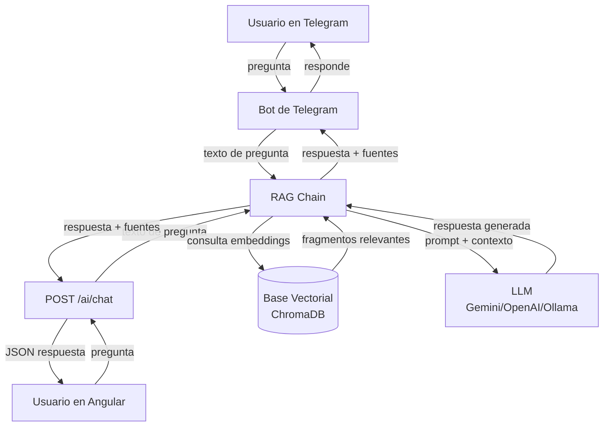

# 📊 Análisis del Proyecto — GestDeportIUB

## Arquitectura General

El proyecto tiene **3 capas** principales:

GestDeportIUB-BackendAngula-main/
├── backend-python/   → FastAPI + PostgreSQL  (puerto 8000)
├── backend-node/     → Express.js            (puerto 3000) — auxiliar (solo catálogos)
└── frontend/         → Angular 19 standalone (puerto 4200)

---

## 🟢 Lo que YA está implementado

### Backend Python (FastAPI)

| Módulo | Archivo(s) | Estado |
|---|---|---|
| Autenticación local + JWT | `auth_controller.py`, `auth_routes.py` | ✅ Completo |
| OAuth Google | `google_auth.py`, `auth_controller.py` | ✅ Completo |
| OAuth Azure/Microsoft | `azure_auth.py` | ✅ Completo |
| CRUD Usuarios | `user_controller.py`, `user_routes.py` | ✅ Completo |
| CRUD Deportes | `deporte_controller.py`, `deporte_routes.py` | ✅ Completo |
| CRUD Horarios/Cursos | `horario_controller.py`, `horario_routes.py` | ✅ Completo |
| CRUD Inscripciones | `inscripcion_controller.py` | ✅ Completo |
| CRUD Torneos + Estados | `torneo_controller.py`, `torneo_routes.py` | ✅ Completo |
| Inscripciones a Torneos | `inscripcion_torneo_controller.py` | ✅ Completo |
| Estadísticas Torneos | `estadisticas_controller.py` | ✅ Completo |
| Roles y Permisos | `role_controller.py`, `permiso_controller.py` | ✅ Completo |
| Auditoría de registros | `auditoria_controller.py`, `auditoria_routes.py` | ✅ Completo |
| Dashboard (conteos) | `dashboard_controller.py`, `dashboard_routes.py` | ✅ Completo |
| **Chat 1-a-1 (contactos)** | `chat_routes.py` | ✅ Ruta GET `/chat/contacts/{user_id}` |
| **WebSocket mensajería** | `websocket_routes.py`, `connection_manager.py` | ✅ Completo (WS `/ws/{client_id}`) |

**Documentos de contexto disponibles (para chatbot IA):**
- `docs/DEPARTAMENTO DE DEPORTES.pdf`
- `docs/Escenarios Deportivos, Seguridad y Protocolos.pdf`
- `docs/Guia Atención al Usuario.pdf`
- `docs/Reglamento Baloncesto.pdf`
- `docs/Reglamento Futbol.pdf`
- `docs/Reglamento Sofbol.pdf`
- `docs/Reglamento de Voleibol.pdf`
- `docs/Reglamento general.pdf`

---

### Frontend Angular

| Feature | Ruta | Estado |
|---|---|---|
| Login / Recuperar contraseña | `/login`, `/recover` | ✅ |
| Panel Admin (Dashboard + módulos) | `/admin` | ✅ |
| Dashboard PowerBI integrado | (dentro de admin) | ✅ |
| Gestión Usuarios | (dentro de admin) | ✅ |
| Gestión Deportes | (dentro de admin) | ✅ |
| Gestión Cursos | (dentro de admin) | ✅ |
| Gestión Torneos | (dentro de admin) | ✅ |
| Auditorías | (dentro de admin) | ✅ |
| Panel Entrenador | `/entrenador` | ✅ (básico) |
| Panel Deportista/Estudiante | `/estudiante` | ✅ (básico) |
| Perfil de usuario | `/perfil` | ✅ |
| Inscripciones | `/inscripciones` | ✅ |
| **Chat WebSocket 1-a-1** | `app-chat-widget` (flotante) | ✅ Implementado como widget global |
| **Página de Chatbot** | (feature `chatbot/`) | ✅ Existe la UI |

> [!NOTE]
> El chatbot de mensajería 1-a-1 está integrado en **dos lugares**:  
> 1. **Widget flotante** (`chat-widget.component`) — visible globalmente en la app para todos los roles (deportista, entrenador, admin).  
> 2. **Página dedicada** (`chatbot-page`) — existe la estructura pero **no tiene ruta registrada** en `app.routes.ts`.

---

## 🔴 Lo que FALTA — La IA del Telegram

Esta es la parte que te corresponde implementar. El proyecto tiene un commit llamado:
> `"feat: integrar autenticación, chatbot y mejoras de torneos"`  

El chatbot actual **NO tiene IA** — solo hace mensajería 1-a-1 entre usuarios humanos. Lo que falta es un chatbot inteligente basado en los **documentos PDF del departamento de deportes**.

### ¿Qué es el "chatbot de IA con Telegram"?

Se trata de un **bot de Telegram** que usa un modelo de lenguaje (LLM) con **RAG (Retrieval-Augmented Generation)** para responder preguntas sobre deportes, reglamentos e inscripciones basándose en los PDFs del `docs/`.

> [!IMPORTANT]
> Hay evidencia directa de esto: el commit `"chore: ignorar base vectorial local"` (`9d50405`) indica que alguien ya empezó a crear una **base de datos vectorial** (embeddings de los PDFs) en local pero la excluyó del repositorio. Esto es el núcleo del sistema RAG.

---

## 📋 Lo que hay que construir: Bot de IA para Telegram

### Componentes necesarios

#### 1. Procesamiento de PDFs → Base Vectorial (RAG)

```
backend-python/
└── app/
    ├── ai/                           ← NUEVO módulo
    │   ├── __init__.py
    │   ├── pdf_loader.py             ← Cargar y procesar PDFs del docs/
    │   ├── vector_store.py           ← ChromaDB / FAISS con embeddings
    │   └── rag_chain.py              ← Cadena de consulta LLM + contexto
    └── routes/
        └── chatbot_ai_routes.py      ← Endpoint REST para consultas de IA
```

**Librerías a agregar en `requirements.txt`:**
```
langchain
langchain-community
langchain-openai  # o langchain-google-genai / langchain-ollama
chromadb          # base vectorial local
pypdf             # leer PDFs
python-telegram-bot  # integración Telegram
```

#### 2. Bot de Telegram

```
backend-python/
└── app/
    └── telegram_bot/                 ← NUEVO
        ├── __init__.py
        └── bot.py                    ← Handler de mensajes Telegram → RAG
```

#### 3. Endpoint REST (para uso desde el frontend también)

```python
# POST /ai/chat
# Body: { "pregunta": "¿Cuál es el reglamento del fútbol?" }
# Response: { "respuesta": "...", "fuentes": [...] }
```

#### 4. Frontend — conectar el ChatbotPage con la IA

La página `chatbot-page` ya existe pero:
- No tiene ruta en `app.routes.ts`
- No tiene servicio que llame al endpoint de IA
- Habría que decidir si el chatbot de IA es **separado** del chat 1-a-1 o si conviven

---

## ⚠️ Problemas / Deuda Técnica Detectada

| Problema | Archivo | Descripción |
|---|---|---|
| Ruta del chatbot no registrada | `app.routes.ts` | La página `/chatbot` no aparece en las rutas |
| Chat widget duplicado | `app.ts` vs `chatbot-page` | Dos implementaciones del chat 1-a-1 |
| `showChatbot` incompleto | `app.ts` L27-28 | Solo muestra el widget para roles específicos, pero verifica roles con strings frágiles (`'estudiante'`, `'admin'`) |
| PDFs no indexados | `docs/` | 8 PDFs listos pero sin pipeline de vectorización |
| Base vectorial local ignorada | `.gitignore` | Alguien ya hizo embeddings localmente pero no están en el repo |
| `requirements.txt` incompleto | `requirements.txt` | Faltan librerías para IA (langchain, chromadb, pypdf, python-telegram-bot) |
| Node backend mínimo | `backend-node/index.js` | Solo expone catálogos auxiliares (tipos doc, facultades, programas, niveles edu) |

---

## 🗺️ Flujo del Chatbot de IA (a implementar)



---

## 📦 Stack Tecnológico Actual

| Capa | Tecnología |
|---|---|
| Frontend | Angular 19 (standalone), Bootstrap 5, Bootstrap Icons |
| Backend principal | Python FastAPI + psycopg2 (PostgreSQL) |
| Backend auxiliar | Node.js Express (PostgreSQL) |
| WebSockets | FastAPI WebSocket nativo |
| Auth | JWT propio + Google OAuth + Azure OAuth |
| BD | PostgreSQL (Neon/Vercel - cloud) |
| Dashboard | Power BI embebido |
| Deploy | Vercel (ambos backends + frontend) |

---

## 🚀 Resumen de prioridades

1. **Alta prioridad (tuya):** Implementar el chatbot de IA con RAG sobre los PDFs + Bot de Telegram  
2. **Media prioridad:** Registrar la ruta `/chatbot` en `app.routes.ts` y conectar con el endpoint de IA  
3. **Baja prioridad:** Unificar el chat 1-a-1 (widget vs. página dedicada)
